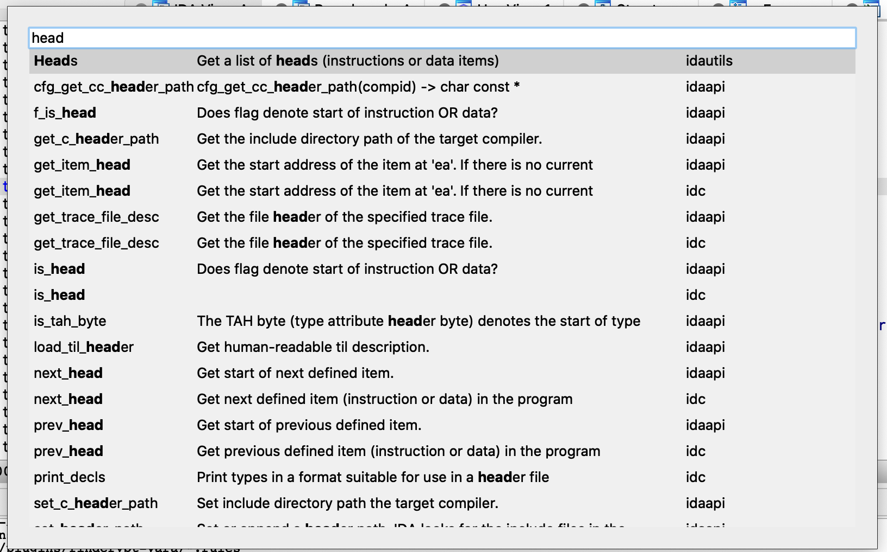

# api_palette

> Originally developed by [Milan Bohacek](mailto:milan.bohacek+apipalette@gmail.com).
>
> This plugin wins the IDA [*Plug-In Contest 2017: Hall Of Fame*](https://www.hex-rays.com/contests_details/contest2017/).

api_palette.py will be useful for those who write scripts for IDA (in the CLI or the script snippets window).

## Changes

- Compatible with Python 3 and IDA 7.5
- Only show/search the first line of doc
- Only search api name and doc

## Usage

The default shortcut is set to Shift + P.

## Screenshot

